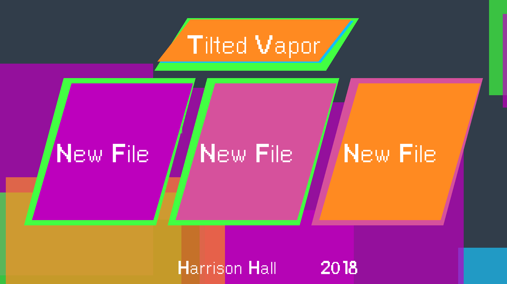
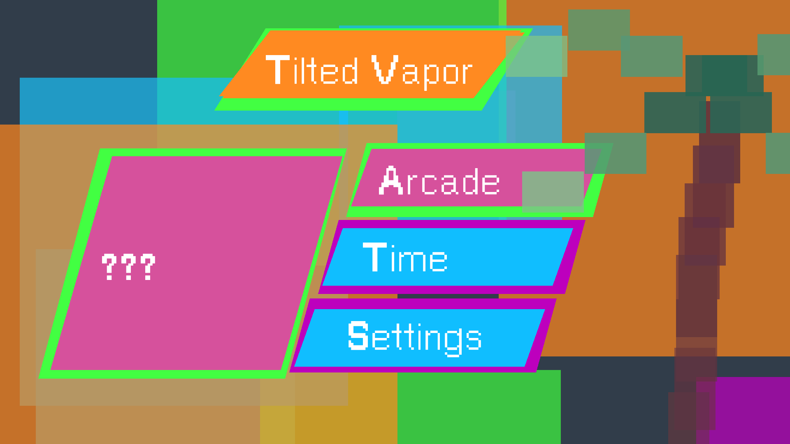
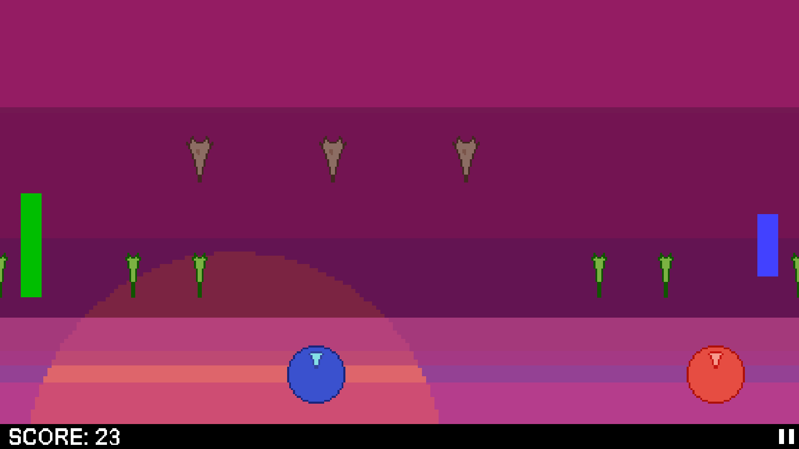
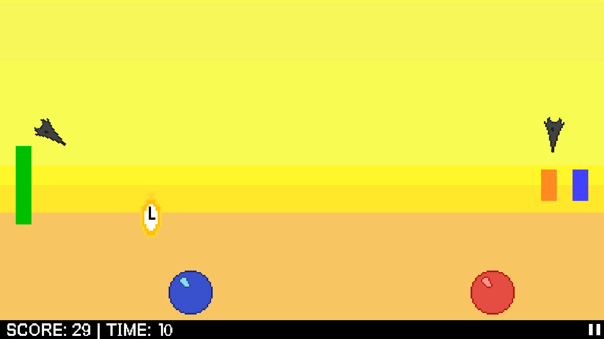

# Tropical Tilt
Source files for an android game developed with GMS. Also contains Android APK. Feel free to use the files for
entertainment or educational purposes. The game is published on [Google Play](https://play.google.com/store/apps/details?id=com.HockoTech.duo_tilt).

## Use
To use the `duo_tilt.gmx` you must have some form of Game Maker Studio 1.
The game is designed to also work with windows (with some extra features), so recompiling for PC should work fine. 

## Notes
* This project began as a Summer project in late May/early June 2018. After three weeks of work it was dropped in
favor of other projects. I wanted to finish the project by the end of summer (as I'd probably never work on it
again), but after a hiatus I returned to package the game even though it would be stripped of the features originally
planned. 
   * Instead of designing music for the game, I slowed down crappy .wav tracks I made in the 11th grade
   * I never updated the skins of the players from really generic balls
   * I never finished any of the levels or bosses originally planned
     * The first level (aside from tutorial) can still be found from the settings menu
* A note on sprites: It was until halfway through development I realized that making crappy sprites was tedius, that's when
I began implementing having the computer draw squares instead of me. Ultimately, I think it gives it a nice look. 

&Omega
**&Omega**
